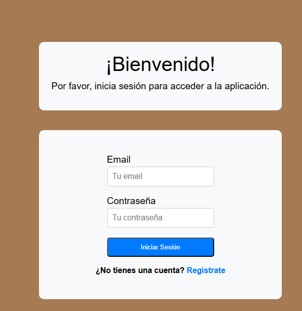
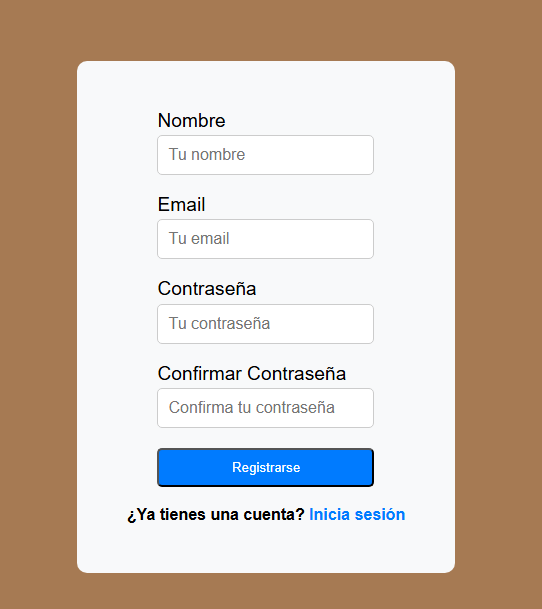
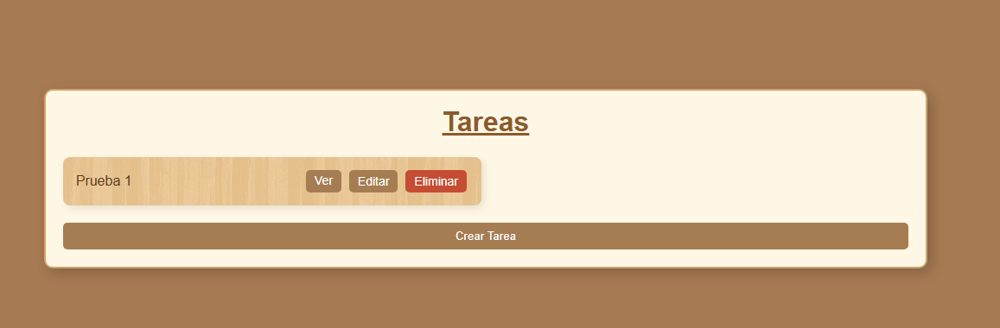
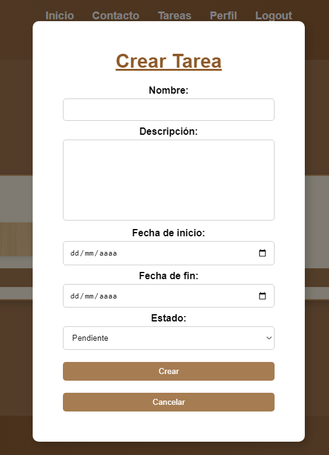
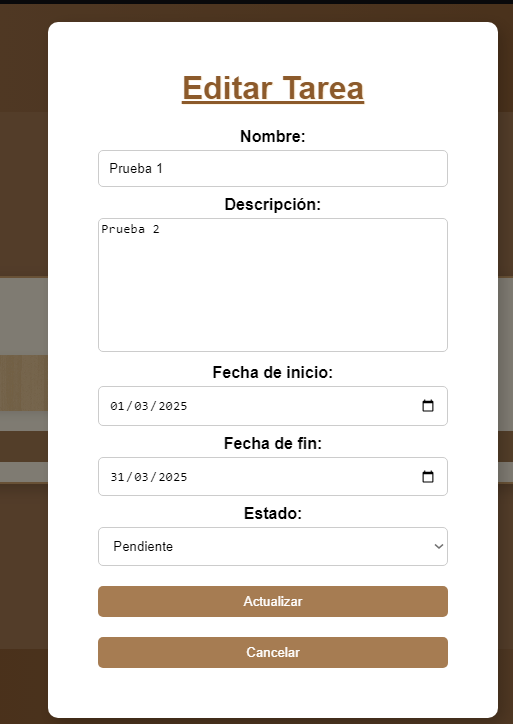
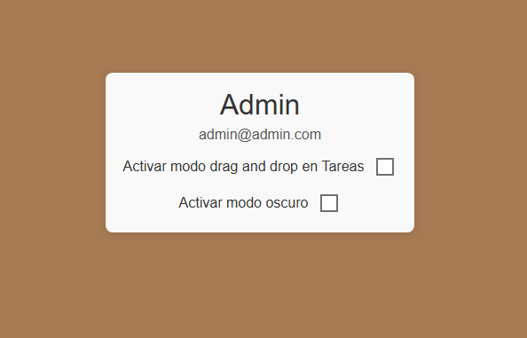
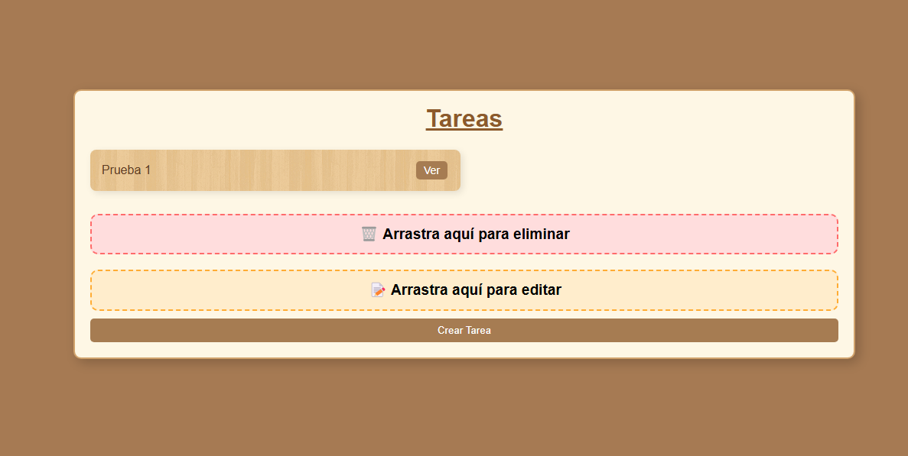
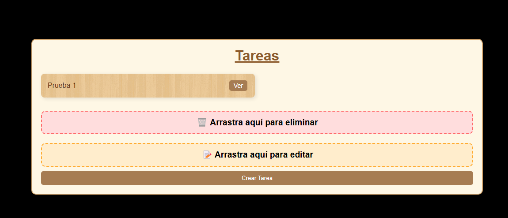
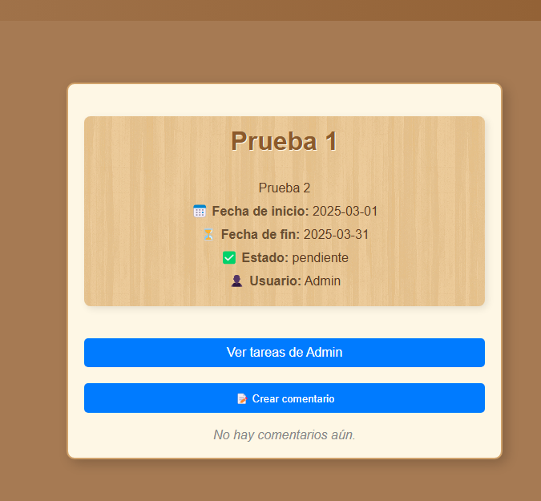
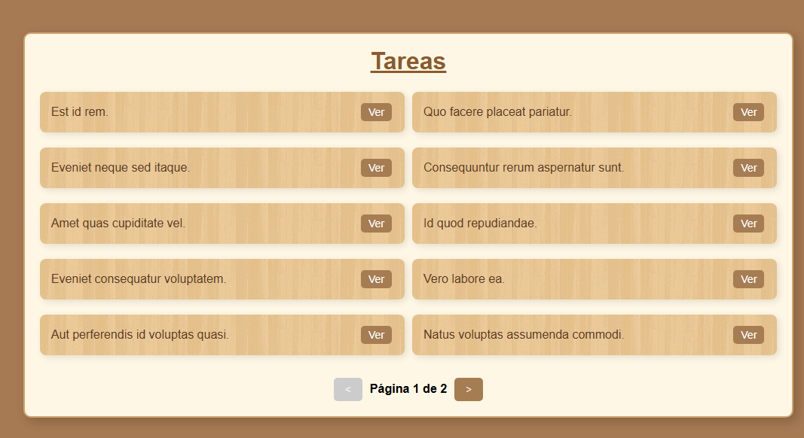

## **Gestor de Tareas Avanzado con Vue.js**

---

## Login

#### Permite el acceso a la aplicación mediante un formulario de login.

---

## Registro

#### Permite el registro de nuevos usuarios mediante un formulario de registro.

---

## Tareas

#### Permite la creación, edición y eliminación de tareas.

--- Agregar Tarea

#### Permite la creación de una tarea.

---

## Editar Tarea

#### Permite la edición de una tarea.

---

## Perfil

#### Permite alguna configuracion sobre el cliente visual del usuario como el modo oscuro y el drag and drop.

---

## Drag and Drop

#### Permite el arrastre de tareas para editarlas o borrarlas.

---

## Modo Oscuro

#### Permite cambiar el tema de la aplicación a modo oscuro.

---

## Tarea

#### Permite la visualización de una tarea.

---

## Paginacion de multiples tareas

#### Permite la visualización de multiples tareas.

